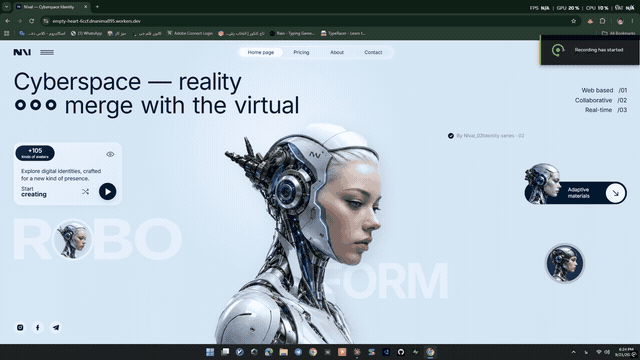

# Nival — Cyberspace Identity

A single-file landing page built around a cursor-following **Spotlight Reveal** effect: as the pointer moves across the hero image, a hidden layer — a darker, armored variant of the character — unmasks inside a soft, cursor-following circle. No video, just a radial gradient mask rendered on a canvas in real time.

▶️ **[View live demo](https://empty-heart-6ccf.dnanima895.workers.dev)** · [View source](index.html)

## Highlights

- Entire page is one self-contained HTML file — no framework, no build step
- A fixed-size "stage" layout, CSS-transform-scaled to fit any viewport
- Three responsive tiers: desktop, tablet/mobile landscape, and real phones (CSS Grid fallback)
- A one-time entrance animation sequenced with the Web Animations API
- Full support for `prefers-reduced-motion` and accessibility (ARIA labels, focus states, live regions)

## Run it

Just open `index.html` in a browser — no dependencies, no build step.
